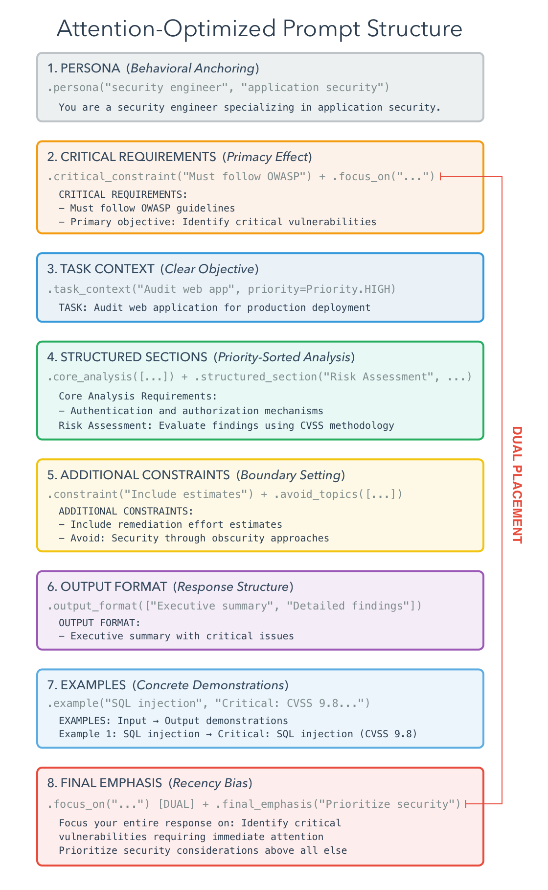

**The best way to generate, test, and deploy LLM chatbots with attention-optimized prompt engineering**

[](https://opensource.org/licenses/MIT)

Talk Box is a Python framework that transforms prompt engineering from an art into a systematic
engineering discipline. Create effective, maintainable prompts using research-backed attention
mechanisms, then deploy them with powerful conversation management.

## 🎯 Why Talk Box?

- **Attention-Based Prompt Engineering**: build prompts that leverage how LLMs actually process
  information
- **Layered API Design**: start simple, discover advanced features as you need them
- **Multiple Usage Patterns**: from quick structured prompts to complex modular components
- **Integrated Conversation Management**: seamless multi-turn conversations with full history
- **Built-in Behavior Presets**: professional templates for common engineering tasks
- **Test-First Design**: develop and test without API keys, deploy when ready



## Quick Start

### 30-Second Demo: Attention-Optimized Prompts

```python
import talk_box as tb

# Create a security-focused chatbot with structured prompts
bot = (
    tb.ChatBot()
    .provider_model("anthropic:claude-sonnet-4-20250514")
    .system_prompt(
        tb.PromptBuilder()
        .persona("senior security engineer", "web application security")
        .critical_constraint("Focus only on CVSS 7.0+ vulnerabilities")
        .core_analysis([
            "SQL injection risks",
            "Authentication bypass possibilities",
            "Data validation gaps"
        ])
        .output_format([
            "CRITICAL: Immediate security risks",
            "Include specific line numbers and fixes"
        ])
        .final_emphasis("Prioritize vulnerabilities leading to data breaches")
        .build()
    )
)

# View details of the structured prompt
bot.show("prompt")
```

<details>
<summary>🔍 View Generated Prompt</summary>

```
You are a senior security engineer with expertise in web application security.

CRITICAL REQUIREMENTS:
- Focus only on CVSS 7.0+ vulnerabilities

CORE ANALYSIS (Required):
- SQL injection risks
- Authentication bypass possibilities
- Data validation gaps

OUTPUT FORMAT:
- CRITICAL: Immediate security risks
- Include specific line numbers and fixes

Prioritize vulnerabilities leading to data breaches
```

</details>

### Even Simpler: Quick Structured Prompts with `structured_prompt()`

```python
import talk_box as tb

# Configure a bot with structured prompts in one go
doc_bot = (
    tb.ChatBot()
    .provider_model("anthropic:claude-sonnet-4-20250514")
    .structured_prompt(
        persona="technical writer",
        task="Review and improve documentation",
        constraints=["Focus on clarity and accessibility", "Include code examples"],
        format=["Content improvements", "Structure suggestions"],
        focus="making complex topics easy to understand"
    )
)

# Now just chat directly as the structure is built into the bot's system prompt
response = doc_bot.chat("Here's my API documentation draft...")
```

<details>
<summary>🔍 View Generated Prompt</summary>

```
You are a technical writer with expertise in documentation and user education.

CRITICAL REQUIREMENTS:
- Focus on clarity and accessibility

CORE ANALYSIS (Required):
- Include code examples
- Ensure content improvements
- Provide structure suggestions

OUTPUT FORMAT:
- Content improvements
- Structure suggestions

Prioritize making complex topics easy to understand
```

</details>

## Core Features

### **Attention-Based Prompt Engineering**

Build prompts that leverage how transformer attention mechanisms actually work:

```python
import talk_box as tb

# Traditional approach (attention-diffused)
old_prompt = "Help me learn Spanish and correct my mistakes."

# Attention-optimized approach
bot = (
    tb.ChatBot()
    .provider_model("anthropic:claude-sonnet-4-20250514")
    .system_prompt(
        tb.PromptBuilder()
        .persona("experienced Spanish teacher", "conversational fluency and grammar")
        .critical_constraint("Focus on practical, everyday Spanish usage")
        .core_analysis([
            "Grammar accuracy and common mistakes",
            "Vocabulary building with context",
            "Pronunciation and speaking confidence"
        ])
        .output_format([
            "CORRECCIONES: Grammar fixes with explanations",
            "VOCABULARIO: New words with example sentences",
            "PRÁCTICA: Conversation prompts for next lesson"
        ])
        .final_emphasis("Encourage progress and build confidence through positive reinforcement")
        .build()
    )
)

# Get learning right in the console
response = bot.show("console")
```

<details>
<summary>🔍 View Generated Prompt</summary>

```
You are an experienced Spanish teacher with expertise in conversational fluency and grammar.

CRITICAL REQUIREMENTS:
- Focus on practical, everyday Spanish usage

CORE ANALYSIS (Required):
- Grammar accuracy and common mistakes
- Vocabulary building with context
- Pronunciation and speaking confidence

OUTPUT FORMAT:
- CORRECCIONES: Grammar fixes with explanations
- VOCABULARIO: New words with example sentences
- PRÁCTICA: Conversation prompts for next lesson

Prioritize encouraging progress and building confidence through positive reinforcement
```

</details>

The key principles of a successful structured prompt implementation are:

- **Front-loading critical information** (primacy bias)
- **Structure creates focus** (attention clustering)
- **Personas for behavioral anchoring**
- **Specific constraints prevent attention drift**
- **Final emphasis leverages recency bias**

And we've implemented these principles in our prompt engineering process, ensuring that the prompts
you create and use are effective and aligned with these best practices.

### **Pre-configured Engineering Templates**

Start with expert-crafted prompts for common engineering tasks:

```python
import talk_box as tb

# Architectural analysis with attention optimization
arch_bot = (
    tb.ChatBot()
    .provider_model("anthropic:claude-sonnet-4-20250514")
    .prompt_builder("architectural")
    .focus_on("identifying technical debt and modernization opportunities")
)

# Code review with structured feedback
review_bot = (
    tb.ChatBot()
    .provider_model("anthropic:claude-sonnet-4-20250514")
    .prompt_builder("code_review")
    .avoid_topics(["personal criticism", "style nitpicking"])
    .focus_on("actionable security and performance improvements")
)

# Systematic debugging approach
debug_bot = (
    tb.ChatBot()
    .provider_model("anthropic:claude-sonnet-4-20250514")
    .prompt_builder("debugging")
    .critical_constraint("Always identify root cause, not just symptoms")
)
```

### **Integrated Conversation Management**

All chat interactions automatically return conversation objects for seamless multi-turn conversations:

```python
import talk_box as tb

bot = tb.ChatBot().model("gpt-4o-mini").preset("technical_advisor")

# Every chat returns a conversation object with full history
conversation = bot.chat("What's the best way to implement authentication?")
conversation = bot.chat("What about JWT tokens specifically?", conversation)
conversation = bot.chat("Show me a Python example", conversation)

# Access the full conversation history
messages = conversation.get_messages()
latest = conversation.get_last_message()
print(f"Conversation has {conversation.get_message_count()} messages")
```

```
Conversation has 6 messages
```

### **Built-in Behavior Presets**

Choose from professionally crafted personalities:

- **`technical_advisor`**: Authoritative, detailed, evidence-based
- **`customer_support`**: Polite, helpful, solution-focused
- **`creative_writer`**: Imaginative, expressive, storytelling
- **`data_analyst`**: Analytical, precise, metrics-driven
- **`legal_advisor`**: Professional, thorough, disclaimer-aware

```python
import talk_box as tb

# Each preset includes tone, expertise, constraints, and system prompts
support_bot = tb.ChatBot().preset("customer_support")
creative_bot = tb.ChatBot().preset("creative_writer")
analyst_bot = tb.ChatBot().preset("data_analyst")
```

### Installation

The Talk Box framework can be installed via pip:

```bash
pip install talk-box
```

If you encounter a bug, have usage questions, or want to share ideas to make this package better, please feel free to [open an issue](https://github.com/rich-iannone/talk-box/issues).

## Code of Conduct

Please note that the Great Tables project is released with a [contributor code of conduct](https://www.contributor-covenant.org/version/2/1/code_of_conduct/).
By participating in this project you agree to abide by its terms.

## License

MIT License - see [LICENSE](./LICENSE) for details.

🏛️ Governance

This project is primarily maintained by [Rich Iannone](https://bsky.app/profile/richmeister.bsky.social). Other authors may occasionally assist with some of these duties.
